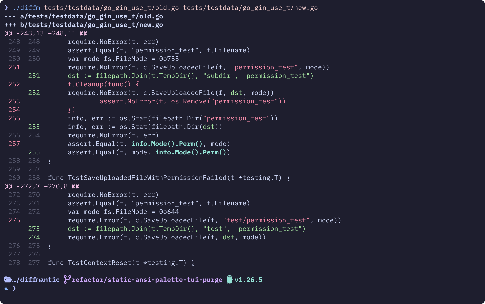

<p align="center">
  <h1 align="center">diffmantic</h1>
  <p align="center">
    <strong>Stop Diffing Text, Start Diffing Logic.</strong>
  </p>
  <p align="center">
    <a href="https://github.com/HarshK97/diffmantic/actions/workflows/ci.yml"></a>
    <a href="https://github.com/HarshK97/diffmantic/releases/latest"></a>
    <a href="https://github.com/HarshK97/diffmantic/blob/main/LICENSE"></a>
    <a href="https://pkg.go.dev/github.com/HarshK97/diffmantic"></a>
  </p>
</p>

---

<p align="center">
  
</p>

---

## Why diffmantic?

AI is generating more code than ever. PRs are getting larger, way more structurally complex, and line-based diffs can't keep up. You move a function three functions down and `git diff` shows it as a delete + re-add. You rename a variable and suddenly dozens of lines light up red and green. The actual Change is buried.

diffmantic parses your code into ASTs using [Tree-sitter](https://tree-sitter.github.io/) and computes structural differences. It knows when a function was Moved, not deleted and re-added. It shows you exactly what changed inside a node, a variable rename, a swapped argument, an updated string literal, instead of highlighting entire lines.

It works as a standalone CLI, a drop-in for `git diff`, or a backend for editor plugins via JSON output.

## Features

- **Move Detection.** When you move a function or a block, diffmantic tracks it as a Move. Not a delete + re-add. Moved functions, blocks, and statements are all first-class.
- **Update & Rename Detection.** Shows exactly what changed inside a syntax node. A variable rename, a string literal swap, a type change, you see the precise edit, not a wall of red and green.
- **Git Integration.** Run `diffm` in any Git repo and it launches an interactive TUI. Browse modified files, stage/unstage changes, commit, all without leaving the terminal.
- **Interactive TUI.** Side-by-side diff view with syntax highlighting, code folding, search, and jump-to-move-counterpart. Built with [Bubbletea](https://github.com/charmbracelet/bubbletea) and [Lipgloss](https://github.com/charmbracelet/lipgloss).
- **JSON Output.** Stable schema with child-index paths (e.g., `[0, 2, 1]`) instead of line numbers. So editor plugins can keep highlights intact even as you edit the file.
- **4 Core Languages.** Go, Python, JavaScript, TypeScript. Full AST normalization and matching rules powered by Tree-sitter.

## Supported Languages

| Language | Extensions |
|:---------|:-----------|
| Go | `.go` |
| Python | `.py` |
| JavaScript | `.js` `.jsx` `.mjs` `.cjs` |
| TypeScript | `.ts` `.tsx` `.mts` `.cts` |

## Installation

### Install Script (recommended)

```bash
curl -fsSL https://raw.githubusercontent.com/HarshK97/diffmantic/main/install.sh | sh
```

This installs the `diffm` binary to `~/.local/bin`. Make sure it's in your `$PATH`.

It auto-detects your OS and architecture, grabs the right binary from [GitHub Releases](https://github.com/HarshK97/diffmantic/releases), and verifies the SHA256 checksum.

```bash
# Install to a specific directory
curl -fsSL https://raw.githubusercontent.com/HarshK97/diffmantic/main/install.sh | sh -s -- --dir=/usr/local/bin

# Install a specific version
curl -fsSL https://raw.githubusercontent.com/HarshK97/diffmantic/main/install.sh | sh -s -- --version=v0.1.0
```

### Homebrew

```bash
brew install HarshK97/tap/diffmantic
```

### Download Binary

Prebuilt binaries for Linux, macOS, and Windows (amd64 + arm64) are on the [Releases page](https://github.com/HarshK97/diffmantic/releases).

### Build from Source

Requires Go 1.24+. No C compiler or CGo required (`CGO_ENABLED=0`), as diffmantic is pure Go!

```bash
git clone https://github.com/HarshK97/diffmantic.git
cd diffmantic
go build -o diffm ./cmd/diffm

# Or install directly with Go:
go install github.com/HarshK97/diffmantic/cmd/diffm@latest
```

> Built with `gotreesitter` for pure Go Tree-sitter AST parsing with zero C compiler or CGo runtime dependencies.

## Usage

### Git Status Mode (default in a repo)

```bash
# Launch the interactive TUI in any Git repository
diffm

# Show only staged changes
diffm --cached
```

### Git Revision Diffing

```bash
# Diff working tree against HEAD
diffm HEAD

# Diff between two commits, tags, or branches
diffm HEAD~1 HEAD
diffm main...feature-branch
```

### File-to-File Diff

```bash
# Interactive TUI (default when a terminal is attached)
diffm diff before.go after.go

# JSON output for editor plugins and automation
diffm diff before.go after.go -f json

# Human-readable action list
diffm diff before.go after.go -f actions

# Override language detection
diffm diff config.txt config2.txt --lang json
```

### As a Git Difftool

```bash
git config --global diff.tool diffm
git config --global difftool.diffm.cmd 'diffm diff "$LOCAL" "$REMOTE" -f tui'

# Then use:
git difftool
```

## How It Works

diffmantic matches ASTs in four phases, based on the [GumTree](https://github.com/GumTreeDiff/gumtree) algorithm:

1. **Top-Down Matching.** We look for identical subtrees by height. When we find an exact match, all nodes in the subtree get mapped together.
2. **Bottom-Up Matching.** For unmatched nodes, we look for counterparts of the same type that share already-matched children. If the Dice similarity score is high enough, we match them.
3. **Recovery.** Inside matched containers, we run LCS alignment on unmatched children. First by exact label, then by structural shape.
4. **Action Generation & Post-Processing.** We produce a raw edit script (insert, delete, update, move) and then refine it. Child edits get collapsed into clean subtree operations, comment changes get normalized, and related moves get grouped.

## Editor Integrations

### Neovim

[diffmantic.nvim](https://github.com/HarshK97/diffmantic.nvim) is the Neovim plugin that started this whole project. It currently ships with its own embedded alpha engine and is being migrated to use the `diffm` CLI as its backend via JSON output.

### VS Code

Planned. The JSON output is built to support editor integration, so if you want to build one, the plumbing is there.

### JSON Schema

`diffm diff -f json` outputs a stable `v1` schema with child-index paths. Take a look at `diffm diff file-a file-b -f json` to see the full structure.

## License

MIT. See [LICENSE](LICENSE).

## Acknowledgements

The engine is based on the GumTree matching algorithm and the Chawathe edit script generator:

- [GumTree: A Complete Approach for AST Differencing](https://hal.science/hal-04855170v1/file/GumTree_simple__fine_grained__accurate_and_scalable_source_differencing.pdf), Falleri et al.
- [Beyond GumTree](https://www.researchgate.net/publication/335498580_Beyond_GumTree_A_Hybrid_Approach_to_Generate_Edit_Scripts), Huvier et al.
- [GumTree GitHub Repository](https://github.com/GumTreeDiff/gumtree)
